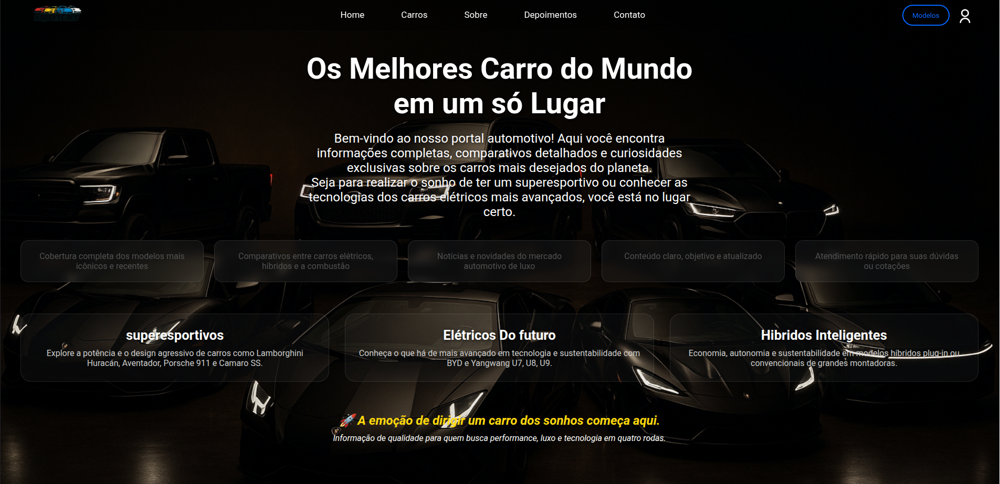

<h1 align="center">🚗 EsportCars</h1>

  Carro a Combustão • Carro Elétrico • Carro Híbrido

  

 

<h2>📌 Sobre o Projeto</h2>

O <strong>EsportCars</strong> é meu segundo projeto de desenvolvimento web, criado com o objetivo de aprimorar minhas habilidades em front-end e desenvolver interfaces mais modernas e responsivas.

Durante o desenvolvimento, foquei na construção de um layout adaptável para diferentes dispositivos, aplicando conceitos de responsividade para melhorar a experiência do usuário em desktops, tablets e smartphones.

Também explorei com mais profundidade o efeito <code>background-attachment: fixed</code>, buscando criar uma experiência visual mais dinâmica, moderna e agradável.

<h2>🛠️ Tecnologias Utilizadas</h2>

<ul>
  <li>HTML5</li>
  <li>CSS3</li>
  <li>JavaScript</li>
</ul>

<h2>🎯 Objetivos de Aprendizado</h2>

<ul>
  <li>Praticar responsividade</li>
  <li>Melhorar estruturação com HTML semântico</li>
  <li>Aprimorar estilização com CSS</li>
  <li>Explorar efeitos visuais modernos</li>
  <li>Fortalecer lógica com JavaScript</li>
</ul>

